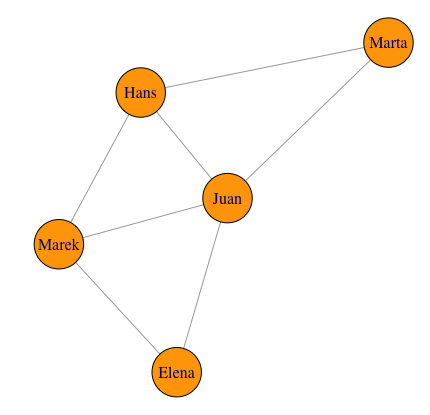
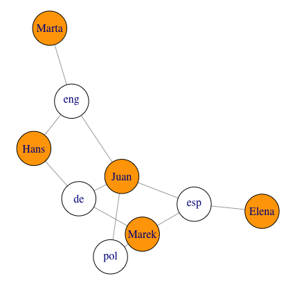
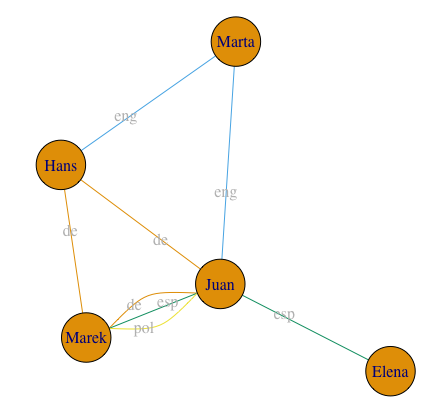
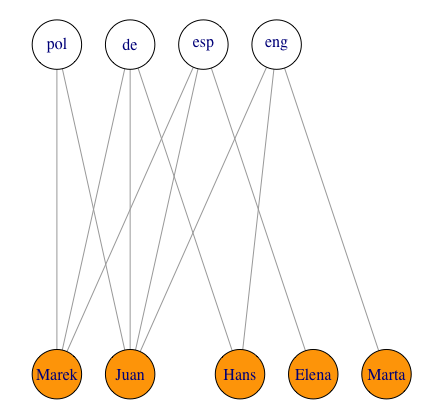
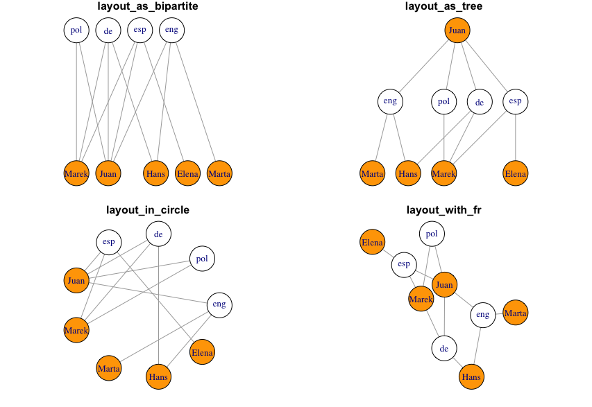
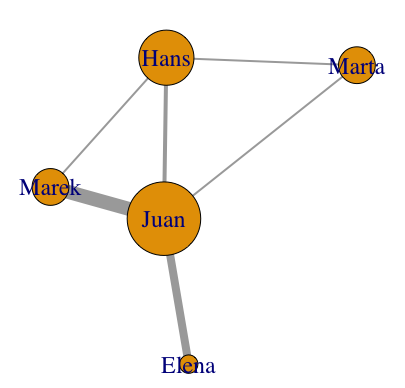
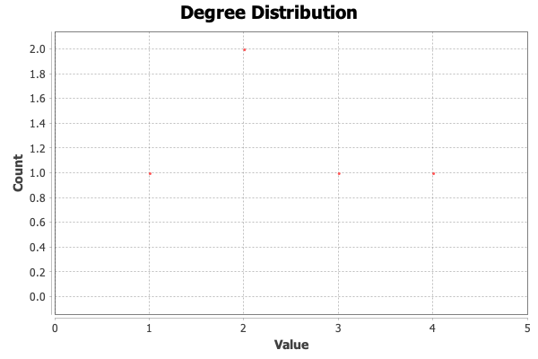
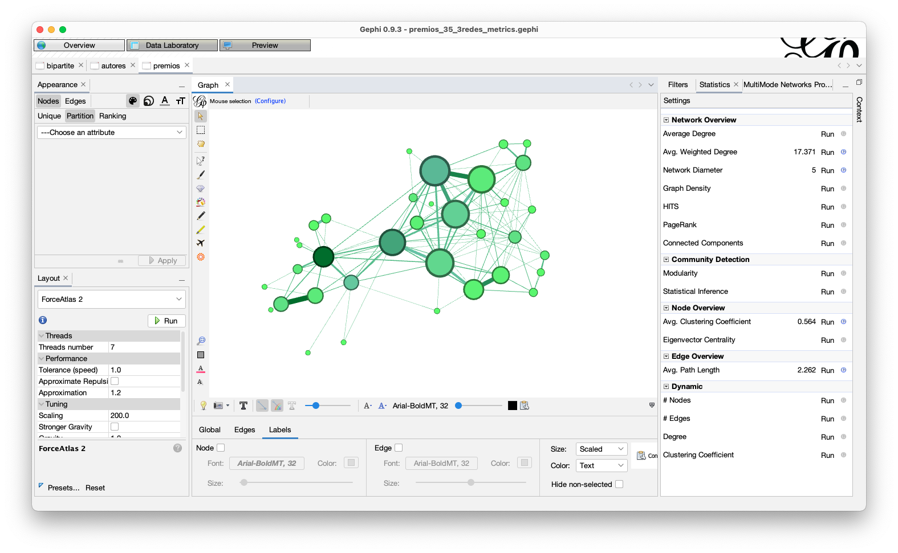

# **Network analysis in the Humanities. Gephi**

RISE crash course: Gephi by José Luis Losada.

Two-hour crash course for introduction to Network analysis and visualization with Gephi.

☞ Course outline

- [Showcase](#showcase)
- [Networks](#networks)
- [Formalization and file formats](#formalization-and-file-formats)
- [Metrics](#metrics)
- [Tools](#tools)
- [Data](#data-for-this-course)
- [Hands-on](#step-by-step-instructions)
- [Tutorials, manuals, references](#tutorial-manuals-references)

# Network analysis in the Humanities

## _Showcase_

- Characters Networks:
    - Co-occurrence in Drama: [Dracor](https://dracor.org)
    - Co-occurrence in Narrative: [_Les Miserables_ (graph)](https://ouestware.gitlab.io/retina/1.0.0-beta.1/#/graph/?url=https%3A%2F%2Fraw.githubusercontent.com%2Fgephi%2Fgephi%2Ff27ae4fc88cd1c43820b31d94eaf7c6df57782d0%2Fmodules%2FWelcomeScreen%2Fsrc%2Fmain%2Fresources%2Forg%2Fgephi%2Fdesktop%2Fwelcome%2Fsamples%2FLes%2520Miserables.gexf&r=v&sa=r&ca=m-s&st=r); [_Les Miserables_ (matrix)](https://bost.ocks.org/mike/miserables/)
    - Dynamic: [Visualising the dynamics of character networks](https://maladesimaginaires.github.io/intnetviz/)
    - Paratexts: [Project Bieses](https://www.bieses.net/editorial.html)
- Textual Networks:
    - [Stylometry on Drama](https://editio.github.io/grafos/teatro)
- Historical Networks:
    - [Mapping the archives of the League of Nations ICIC (1919-1927)](https://grandjeanmartin.github.io/intellectual-cooperation)
- Spatial Networks:
    - [Core vs periphery](https://editio.github.io/mapping.literature/spatialnet.html#persiles_core_vs_periphery)
- Bibliographic networks::
    - Citation: [Vosviewer](https://tinyurl.com/y36v4cb3)
    - Content similarity: [Connected Papers](https://www.connectedpapers.com/main/3149a915f738f044778e3decdb4278e2bad17808/Gephi%3A-An-Open-Source-Software-for-Exploring-and-Manipulating-Networks/graph)
- Cultural networks:
    - [Awards and winners](https://w.wiki/52Ju) 
- Semantic networks:
    - [Word Families](https://www.rae.es/dhle/dhle_grafo.php?id=39279)
    
# Networks

|network |nodes|edges|
|--|--|--|
|Theater Plays|character|co-appearance on the scene|
|Stylometry|plays|stylistic similarity|
|Scientific collaboration|authors|co-authoring|
|...|... |...|

- Method of representing connection or interaction patterns between parts of a system.

- The concept of network supposes a relational structure that can be studied (1) in a logical and mathematical way: Graph theory (discipline). History: [Euler and the seven bridges of Königsberg](https://medium.com/@satoshihgsn/seven-bridges-of-königsberg-can-this-diagram-be-drawn-in-a-single-stroke-e261980711a1).
- (2) Exploration through visualization.


## Basic concepts. Nodes and edges

- Network: points joined by lines.
- points: _nodes_ or _vertices_.
- lines: _edges_ o _links_.
- Attributes: extra information about nodes or edges
- Types of networks:
    - Defined by the nodes: [bipartite](https://mathworld.wolfram.com/BipartiteGraph.html), [simple](https://mathworld.wolfram.com/SimpleGraph.html), [disconnected](https://mathworld.wolfram.com/DisconnectedGraph.html), ...
    - Define by the edges: [multiple](https://mathworld.wolfram.com/Multigraph.html), [directed](https://mathworld.wolfram.com/DirectedGraph.html), ...

## Simple Network



## Bipartite Network


 
## Multiple Network

 

# Formalization and file formats

## Formalization

Edgelists, matrices, adjacency lists

**Edgelist**: it is a set of structured data that contains at least two columns: a column of nodes that are the source of a connection (source) and another column of nodes that are the destination of the connection (target). The rest of the columns correspond to the attributes.

|source |target|weight|lang|type|
|-------|------|----|-----|----|
|Juan|Elena |4 |esp     |undirected|
|Juan|Hans  |2  |de     |undirected|
|Juan|Marta  |1 |eng     |undirected|
|Juan|Marek |1  |de     |undirected|
|...|... |... |...|...|

**[Adjacency matrix](https://mathworld.wolfram.com/AdjacencyMatrix.html)**: a square matrix (equal number of columns and rows)

| |Juan|Hans|Elena|Marta|Marek|
|--|--|------|----|-----|----|
|**Juan**|0|1|1|1|1|
|**Hans**|1|0|0|1|1|
|**Elena**|1|0|0|0|0|
|**Marta**|1|1|0|0|0|
|**Marek**|1|1|0|0|0|

## File Formats

- ```CSV```. Edgelist in CSV:

```
source,target,language,weight
Juan,Elena,esp,4
Juan,Hans,de,2
Juan,Marta,eng,1
Juan,Marek,de,1
Juan,Marek,esp,1
Juan,Marek,pol,5
Hans,Marta,eng,1
Hans,Marek,de,1
```

- ```CSV```. Edgelist + Nodes in CSV:

```
source,target
1,4
1,2
1,3

id,Label
1,Juan
2,Hans
3,Marta
4,Elena
```
It is recommended to save structured data in CSV, although Gephi accepts tables in Excel.

- ```gexf``` (XML)

```xml
[...]
      <node id="Marek" label="Marek">
        <attvalues>
          <attvalue for="att1" value="2.0"/>
        </attvalues>
        <viz:size value="4.0"/>
        <viz:position x="-22.013721" y="26.080078"/>
        <viz:color r="255" g="99" b="71"/>
      </node>
    </nodes>
    <edges>
      <edge id="0" source="Juan" target="Hans" weight="2.0"/>
      <edge id="1" source="Juan" target="Elena" weight="4.0"/>
      <edge id="2" source="Juan" target="Marta"/>
      <edge id="3" source="Juan" target="Marek" weight="7.0"/>
      <edge id="4" source="Hans" target="Marta"/>
      <edge id="5" source="Hans" target="Marek"/>
    </edges>
  </graph>
</gexf>
```

- [More file formats](https://gephi.org/users/supported-graph-formats/) (supported by Gephi)

# Visualization (_spatialization_)

Same network, different layout.


Bipartite network



## Algorithms for drawing the graph



- Common Gephi Algorithms: _Force Atlas_, _Fruchterman Reingold_,...

# Metrics



- _Degree centrality_: nº of connections.
- _Betweenness centrality_: bridge nodes. 
- _Eigenvector centrality_: nodes connected to well-connected nodes.
- _Modularity_ (Louvain, Leiden algorithms): clusters of nodes.
- ...



# Tools

Workflow: from data to visualization.


- Programming languages (full workflow): R, Python, JavaScript,...
- OpenRefine, Table2net,...
- Tableau, Nodegoat,...
- Gephi, Cytoscape, VOSviewer,...

## Gephi. Open Graph Viz Platform

Gephi has restarted its development in recent years.  It can be downloaded from its <https://gephi.org> page or directly from the repository on github [gephi/releases](https://github.com/gephi/gephi/releases).

One of the advantages of the new versions (since 0.9.3) is that it already comes with Java (program language and execution environment for programs such as Gephi). More about the installation at <https://gephi.org/users/install/>.

## Interface: Panel _Overview_



## Plugins for Gephi:

They are located in ```Tools > Plugin```. They add extra functionalities to Gephi (metrics, import, export, spatializations, ...).

- _Multimode networks transformation_: it projects a bipartite network into a simple one.

- _Sigma exporter_: it exports the graph to visualize it dynamically using javascript and html.

- _Leiden algorithm_: Modularity algorithm.

# Data for this course

CSV and GEXF files are located in the folder ```/data``` in this repository

## Theater

Co-appearance character networks in theater. The source of the data is <https://dracor.org>, from where they can be downloaded; I add them to ```/data``` just as back up copy.

  - ```calderon_VidaEsSueno_ezlinavis.csv```
  - ```span000014-valle-luces.gexf```

## Literary awards

35 literary awards and 1325 award-winning authors: data obtained from Wikidata. CSV table with 3 variables: prizes, winners and gender (masc./fem.); bipartite network and simple networks in GEXF format.

- ```authors_and_awards.csv```
- ```authors_and_awards.gexf```
- ```authors.gexf```
- ```awards.gexf```

Dataset (+ node and egdes lists) is available in [editio/premios-literarios](https://github.com/editio/premios-literarios) and Zenodo: José Luis Losada (2022) [](https://doi.org/10.5281/zenodo.6464417)

## Stylometry

Stylometry Network of plays of 17th. C. Spanish  Theater. The nodes represent plays linked according to their stylistic similarity. Analysis performed using the consensus tree (2000-5000 MFW) and Delta distance with the R package, stylo (Eder, Rybicki and Kestemont, 2016), on a corpus of circa 700 plays and 50 authors. Interactive visualization in: [Stylometry on Drama](https://editio.github.io/grafos/teatro)

- ```stylometry_theater.gexf```

## Bibliography

Co-authoring network of 3500 publications on Stylometry. The bibliography has been compiled by Christof Schöch, _Bibliography on Stylometry_, 2017, DOI: [10.5281/zenodo.835190](https://doi.org/10.5281/zenodo.3629772).

- ```biblio_stylo.gexf```

# Step-by-step instructions
 
## Character networks

☞ Practice the basics of an edgelist, how to load it into Gephi and perform the first steps of visualization and metrics.

1. Dracor > tools > https://ezlinavis.dracor.org > Examples > Calderón de la Barca> download _edge list_.
2. Gephi > Import spreadsheet (CSV) > next > finish.
- Layout: Fruchterman Reingold.
- Nodes size based on _degree_: Appearance > nodes > size  > Ranking > Choose an attribute > Degree [min. 10 - max. 50].
- Nodes labels: "copy data to other column" (_Data laboratory_). Alternative: "select attributes to display as labels" (_Overview_).
- Centrality measures (Betweenness/Eigenvector): Segismundo vs Clarín (statistics > Network Diameter; Eigenvector Centrality).

☞ Familiarize with GEXF file format, open en Gephi, nodes attribute (male/female).

1. Dracor > corpora > [Spanish Drama Corpus](https://dracor.org/span) > Valle Inclán, _Luces de bohemia_ > Downloads > Archivo en gexf.
2. Gephi > open > [no changes] > ok.
- Data exploration: _label_, _gender_ (_Data laboratory_).
- Appearance > nodes > color [icon palette] > Partition > Choose an attribute > gender
- Layout: Force Atlas 2 [Prevent overlap, Disuade Hubs, Scaling = 40] > run|stop.

## From the data to the network: awards and winners

☞ Transform structured data (CSV) into an edgelist (GEXF)

1. ```/data``` > ```authors_and_awards.csv```
2. [table2net](https://medialab.github.io/table2net/) (transformation in the browser).
3. Load table > Type of Network > Nodes > Build the network > Download.

  - 3.1 Network type: bipartite.
  - 3.2 Nodes 1: authors | attribute: masc/fem.
  - 3.3 Nodos 2: awards.

## Awards and winners network (1)

☞ Explore bipartite networks.

1. Gephi > open ```authors_and_awards.gexf```.
- Layout: Force Atlas 2 > run|stop; > Prevent overlap > run|stop; Zoom
- Appearance > nodes > color [icon palette] > Partition > Choose an attribute > Type
- Appearance > nodes > size [icon circles] > Ranking > Choose an attribute > Degree [min. 10 - max. 50] (number of authors by award).
- Nodes Labels: Show node Labels; More settings > Labels > Hide non-selected. 
- [reset colors] > Appearance > nodes > color [icon palette] > Partition > Choose an attribute > gender.

## Awards and winners network (2)

☞ Explore simple networks

Files are available in ```/data/awards.gexf```; ```/data/authors.gexf```. They can also be created from the structured data (CSV) with ([table2net](https://medialab.github.io/table2net/)) o using a transformation from the bipartite network (☞ _vide infra_).

1. Gephi > open ```awards.gexf```
  - Layout: Force atlas 2 [Prevent overlap, Disuade Hubs, Scaling = 50]
  - Appearance > nodes > size [icon circles] > Ranking > Choose an attribute > Degree [min. 5 - max. 30].
  - Modularity: Community detection > Modularity > run.
  - Appearance > nodes > color [icon palette] > Partition > Choose an attribute > Modularity Class.

  - Check centrality metrics:
      - Statistics > eigenvector Centrality.
      - Appearance > nodes > size [icon circles] > Ranking > Choose an attribute > eigenvector Centrality.

2. Gephi > open ```authors.gexf```
  - Layout: Layout: Fruchterman Reingold.
  - Appearance > nodes > color [icon palette] > Partition > Choose an attribute > sexlabel.
  - Appearance > nodes > size [icon circles] > Ranking > Choose an attribute > Degree [min. 5 - max. 30].

☞ Switching from one type of network to another (projection).

1. Plugin: multimode networks transformation.
  
  - Bipartite Network.
  - Load attributes > type:
    - Premio > Autor / Autor > Premio (Simple network of awards)
    - Autor > Premio / Premio > Autor (Simple network of authors)
  - Remove nodes, edges.
  - Run.

## Stylometry

☞ Explore textual networks

1. Gephi > open ```stylometry_theater.gexf```.
- Layout: Force atlas 2 [Prevent overlap, Disuade Hubs, Scaling = 200].
- Appearance > nodes > color [icon palette] > Partition > Choose an attribute > Classes (autores) > Palette > Generate [Limit number of colors: unchecked] > generate.
- Appearance > nodes > size [icon circles] > Unique > size = 20.
- Nodes Labels: Show node Labels; More settings > Labels > Hide non-selected.  

Compare with modularity algorithms:

- Modularity: Community detection > Modularity > run.
- Appearance > nodes > color [icon palette] > Partition > Choose an attribute > Modularity Class.

## Bibliography

☞ Explore disconnected networks

1. Gephi > open ```biblio_stylo.gexf```.
- Layout: Layout: Fruchterman Reingold (compare with Force Atlas 2).
- Compare with modularity algorithms:


## Out of Gephi: Publication possibilities

☞ Static and dynamic forms of graph representation outside Gephi

1. Panel _Overview_: Screeshot (left), More settings (right)...
2. Panel _Preview_: export SVG, PNG, PDF.
3. Plugin: _Sigma Exporter_. It creates a folder with the required libraries, data and files to display the graph interactively in a browser. It is necessary to upload it to a web server, for example, using [Github Pages](https://pages.github.com). For testing purposes, It is possible to launch a local server: [Instrucciones](http://phc.uni.wroc.pl/interreg/w/losada/trans.html#web-server-in-your-computer).
4. [Retina](https://ouestware.gitlab.io/retina/1.0.0-beta.1/) (Web app, beta): 
Visualization in the browser (offline / online) from a GEXF file.

# Tutorials, manuals, references

- Albert-László Barabási, [Network Science](http://networksciencebook.com), 2016.
- Mathieu Bastian, Sebastien Heymann, Mathieu Jacomy, “Gephi: An Open Source Software for Exploring and Manipulating Networks”, _International AAAI Conference on Weblogs and Social Media_, 2009, pp. 361-362.
- Gephi, [Learn how to use Gephi](https://gephi.org/users/).
- Martin Grandjean, [Gephi: Introduction to Network Analysis and Visualization](http://www.martingrandjean.ch/gephi-introduction), 14/10/2015.
- Mathieu Jacomy, “A standard for presenting network visualizations”, _Reticular_, 01/03/2019, <https://reticular.hypotheses.org/834>.

- Clément Levallois, [Gephi tutorials](https://seinecle.github.io/gephi-tutorials/), Last update: 2022.
- Mark Newman, _Networks: An Introduction_, Oxford University Press, 2010.
- Katherine Ognyanova, [Static and dynamic network visualization with R](https://kateto.net/network-visualization), 2021
- Katharina A. Zweig, _Network Analysis Literacy: A Practical Approach to the Analysis of Networks_, Springer, 2016.


